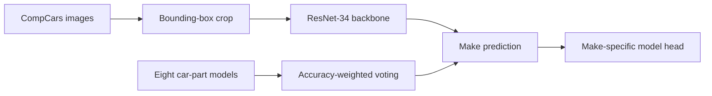

# Enhanced Fine-Grained Car Classification

Deep-learning project for hierarchical vehicle recognition on the **CompCars** dataset. The project classifies vehicle **make** and **make–model** pairs from full-car imagery, then explores whether specialised classifiers trained on individual car parts can improve the final prediction.

> A Computer Vision university project focused on the practical problem of recognising visually similar and imbalanced vehicle classes.

## Project at a glance

| Challenge | What I built | Outcome |
| --- | --- | --- |
| Fine-grained recognition across visually similar car makes and models, with strongly imbalanced classes. | A ResNet-34-based hierarchical classifier, Focal Loss for minority classes and an accuracy-weighted ensemble of car-part models. | **94.35% mean balanced model accuracy** on the fine-grained task; **92.81% make accuracy** with part-based weighted voting. |

## What I built



- Fine-tuned a ResNet-34 backbone initialised from ImageNet weights for **75 car makes**.
- Designed a hierarchical **make → model** prediction pipeline rather than treating all make–model pairs as one flat class space.
- Applied **Focal Loss** and targeted augmentation to improve treatment of underrepresented classes.
- Trained classifiers for eight vehicle parts—headlights, taillights, foglights, air intakes, consoles, steering wheels, dashboards and gear levers—and combined their outputs through **weighted voting**.

## Results

All values below are from the original experiments included in [`Results/`](Results). Metrics are reported on the held-out test split. “Mean balanced model accuracy” is averaged across eligible makes (makes with more than one model).

| Experiment | Make accuracy | Make balanced accuracy | Model accuracy | Top-3 model accuracy | Mean balanced model accuracy |
| --- | ---: | ---: | ---: | ---: | ---: |
| Make classification — Cross-Entropy (3 runs) | 90.74% ± 1.37% | 84.92% ± 1.25% | — | — | Macro F1: 86.52% ± 1.29% |
| Fine-grained make–model — Cross-Entropy | 94.82% | 91.77% | 93.46% | 99.22% | 93.52% |
| Fine-grained make–model — Focal Loss for make head | 93.82% | 90.36% | **94.00%** | 99.22% | **94.35%** |
| Part-based weighted voting | 92.81% | 80.73% | 71.98% | 86.89% | 73.68% |

For make classification, the Focal Loss configuration also increased the lowest per-class F1 from **0.3529** to **0.5000**, demonstrating a better outcome on underrepresented classes. See the complete methodology and analysis in [the project report](Project_Report.pdf).

<p align="center">
  
  
</p>

## Repository guide

| Path | Purpose |
| --- | --- |
| `make_main.py` | Make classification with Cross-Entropy. |
| `make_focal_main.py` | Make classification with Focal Loss and minority-class augmentation. |
| `fine_grained.py` | Hierarchical make–model classification. |
| `part_fine_grained.py` | Training/evaluation for one car-part classifier at a time. |
| `voting.py` | Accuracy-weighted ensemble of the eight part classifiers. |
| `custom_dataset.py` | Dataset loaders, crops and label mappings. |
| `resnet34.py` | ResNet-34 backbone and hierarchical classification model. |
| `network_utility.py`, `metrics.py` | Loss, early stopping, evaluation and plotting helpers. |
| `Results/` | Selected original experiment artefacts and metrics. |
| `Project_Report.pdf` | Full technical report. |

<details>
<summary>Technical notes and setup</summary>

### Setup

The experiments were developed in Python with PyTorch. A CUDA-capable GPU is recommended for training, while evaluation can run on CPU.

```powershell
python -m venv .venv
.\.venv\Scripts\Activate.ps1
pip install -r requirements.txt
```

Download the CompCars data separately; it is not distributed with this repository. The scripts expect the following local layout, relative to the repository root:

```text
Prog/
└── data/
    ├── image/                         # full vehicle images
    ├── label/                         # corresponding CompCars annotations
    ├── part/                          # car-part images
    └── train_test_split/
        ├── classification/
        │   ├── train.txt
        │   └── test.txt
        └── part/
            ├── train_part_1.txt … train_part_8.txt
            └── test_part_1.txt  … test_part_8.txt
```

The data folder and trained checkpoints are intentionally ignored by Git. If your CompCars extraction uses different names or locations, update the dataset paths at the top of the relevant script.

### Running experiments

```powershell
# Car make classification
python make_main.py

# Make classification with Focal Loss
python make_focal_main.py

# Hierarchical make–model classification
python fine_grained.py

# Train one part-specific model; change the train/test part split per run
python part_fine_grained.py

# Ensemble evaluation; requires the eight saved <part>_model.pt checkpoints
python voting.py
```

The training scripts write checkpoints, plots and metric files in the working directory. Move the artefacts you want to retain into a named experiment folder under `Results/` after checking them.

### Notes

- The committed result artefacts come from the original university experiments; this repository does not include the CompCars data or trained weights.
- Seeds are set in the training scripts, but bit-for-bit reproducibility is not guaranteed across PyTorch, CUDA and hardware versions.
- The project uses the dataset’s supplied train/test split and creates a validation split from the training data.

</details>

## Reference

Luca Fusaro, *Enhanced Fine-Grained Car Classification Using Focal Loss and Part-Based Voting Models*. See [Project_Report.pdf](Project_Report.pdf) for the full report, dataset background and citations.
